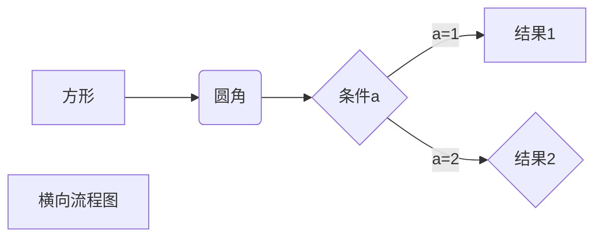
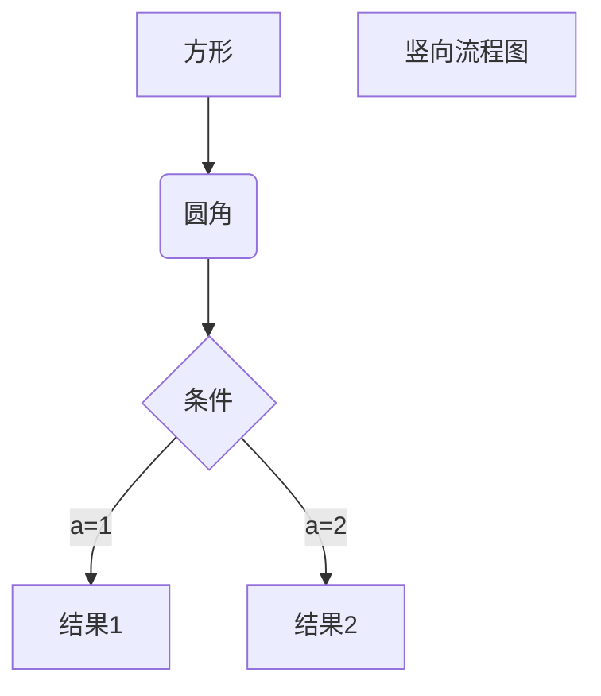

# 横向流程图源码格式:

```mermaid
graph LR
A[方形] -->B(圆角)
B --> C{条件a}
C -->|a=1|D[结果1]
C -->|a=2|E{结果2}
F[横向流程图]
```

# 竖向流程图源码

```mermaid
graph TD
A[方形] --> B(圆角)
B --> C{条件}
C -->|a=1|D[结果1]
C -->|a=2|E[结果2]
F[竖向流程图]
```

# 标准流程图

```mermaid
sequenceDiagram
participant 客户端
participant spark集群
loop AAA
	spark集群->spark集群
end
spark集群 -->Hadoop

```

